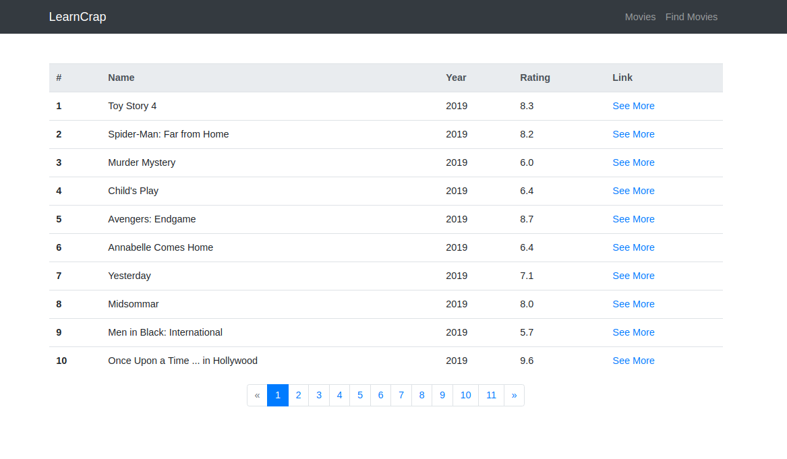
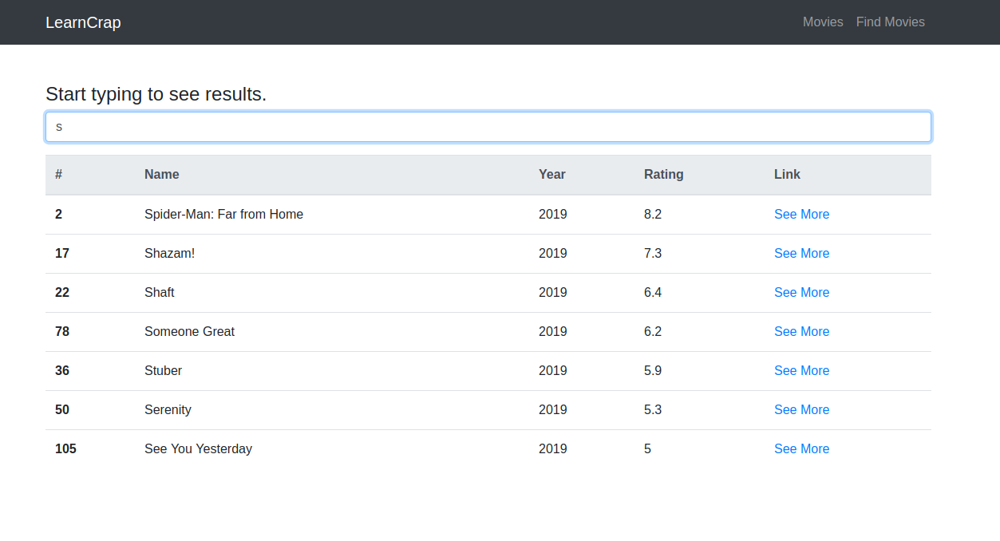
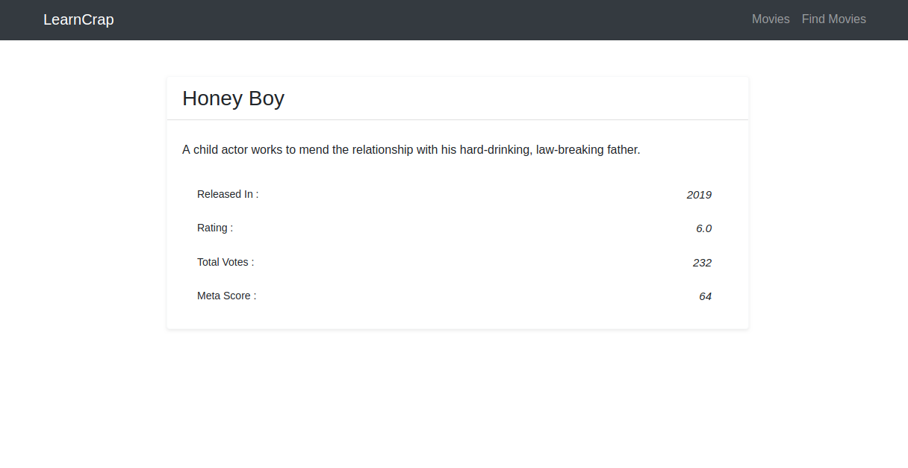

# SCRAP AND SERVE

## Why
I have created this project to enhance my web development skills. In this project, I scrapped N number of movies data from XYZ website and store them in the database also created a front end UI to show all those data. There is a total of three pages, one to show all the data with pagination, another to see the single entity and the last page to filter data from database using ajax

## Deployment Link
NOT DEPLOYED.

### How to run
    1) clone
    2) open terminal in same folder
    3) type : python3 manage.py runserver (linux)
    4) hit enter, and browser https://127.0.0.1:8000

### Landing view

## list of technologies

* HTML
* BOOTSTRAP
* JavaScript (vanila)
* DJANGO
* PYTHON
* Beautiful Soup
* AJAX

# Another snapshots

    

